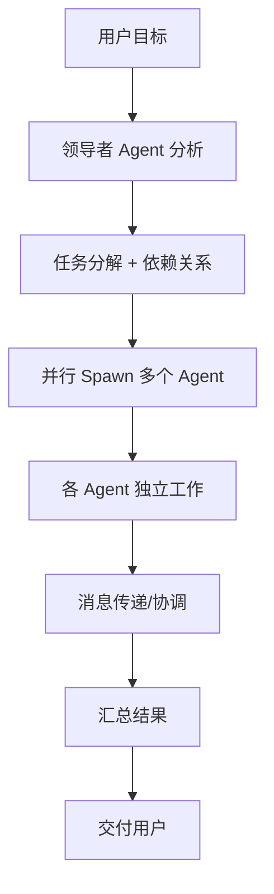

# 🏗️ SaaS 平台与 Agent 团队协作开发笔记

**整理日期:** 2026-03-28  
**整理人:** 小爪 ⚡  
**来源:** 主 Agent 对话 + 知识库文档

---

## 📌 项目愿景

打造一个**以 SaaS 系统为基底**的综合性平台，支持多种业务系统扩展，并深度集成 AI 能力。

### 核心目标

1. **SaaS 基础平台** — 多租户架构、用户权限、计费订阅
2. **业务系统扩展** — 电商、党建、校园、OA、ERP、CMS、博客、客服、报表、大屏看板
3. **AI 深度集成** — 所有系统对接 AI，提供 MCP 工具
4. **智能体生态** — 开发和沉淀各类 Skill（如小红书、跨境电商、数字人直播、股市分析等）

---

## 🏛️ SaaS 平台架构

### 整体架构图

```
┌─────────────────────────────────────────────────────────────────┐
│                        用户层 (User Layer)                       │
│  ┌─────────┐ ┌─────────┐ ┌─────────┐ ┌─────────┐ ┌─────────┐   │
│  │ 电商系统 │ │ 党建系统 │ │ 校园系统 │ │ OA/ERP  │ │ CMS/博客 │   │
│  └────┬────┘ └────┬────┘ └────┬────┘ └────┬────┘ └────┬────┘   │
└───────┼───────────┼───────────┼───────────┼───────────┼────────┘
        │           │           │           │           │
        └───────────┴─────┬─────┴───────────┴───────────┘
                          │
┌─────────────────────────▼─────────────────────────────────────┐
│                    API Gateway (统一入口)                       │
│              认证 │ 限流 │ 路由 │ 日志                          │
└─────────────────────────┬─────────────────────────────────────┘
                          │
┌─────────────────────────▼─────────────────────────────────────┐
│                   SaaS 核心服务层                               │
│  ┌─────────────┐ ┌─────────────┐ ┌─────────────┐              │
│  │ 多租户管理   │ │ 用户/权限   │ │ 计费/订阅   │              │
│  │ Tenant Mgr  │ │  RBAC/IAM   │ │  Billing    │              │
│  └─────────────┘ └─────────────┘ └─────────────┘              │
│  ┌─────────────┐ ┌─────────────┐ ┌─────────────┐              │
│  │ 工作流引擎   │ │ 通知中心    │ │ 文件存储    │              │
│  │  Workflow   │ │  Notif.     │ │   Storage   │              │
│  └─────────────┘ └─────────────┘ └─────────────┘              │
└─────────────────────────┬─────────────────────────────────────┘
                          │
┌─────────────────────────▼─────────────────────────────────────┐
│                    AI 集成层 (AI Integration)                   │
│  ┌─────────────┐ ┌─────────────┐ ┌─────────────┐              │
│  │ MCP Server  │ │ Skill 引擎  │ │ LLM 网关     │              │
│  │  (工具协议)  │ │ (智能体)    │ │ (模型路由)   │              │
│  └─────────────┘ └─────────────┘ └─────────────┘              │
└─────────────────────────┬─────────────────────────────────────┘
                          │
┌─────────────────────────▼─────────────────────────────────────┐
│                    数据层 (Data Layer)                         │
│  ┌─────────────┐ ┌─────────────┐ ┌─────────────┐              │
│  │  MySQL      │ │   Redis     │ │  LanceDB    │              │
│  │ (业务数据)   │ │  (缓存)     │ │ (向量记忆)   │              │
│  └─────────────┘ └─────────────┘ └─────────────┘              │
└───────────────────────────────────────────────────────────────┘
```

---

## 🏢 多租户架构设计

### 推荐方案：混合策略

| 策略 | 适用客户 | 隔离级别 | 成本 |
|------|----------|----------|------|
| **行级隔离** (默认) | 90% 中小客户 | 应用层隔离 | 低 |
| **独立数据库** (VIP) | 10% 企业客户 | 物理隔离 | 高 |

### 租户识别方式

1. **Subdomain (推荐)** — `https://acme.saas.com` → tenant: acme
2. **Custom Domain** — `https://app.acme.com` → CNAME → 映射 tenant
3. **Header / JWT Claim** — `X-Tenant-ID: acme`
4. **Path Prefix (不推荐)** — `https://saas.com/acme/dashboard`

### 数据库设计核心

```sql
-- 租户表
CREATE TABLE tenants (
  id VARCHAR(20) PRIMARY KEY,
  name VARCHAR(255) NOT NULL,
  subdomain VARCHAR(100) UNIQUE,
  plan ENUM('free', 'pro', 'enterprise'),
  created_at TIMESTAMP DEFAULT NOW()
);

-- 用户表 (所有租户共享，关键：tenant_id)
CREATE TABLE users (
  id BIGINT PRIMARY KEY AUTO_INCREMENT,
  tenant_id VARCHAR(20) NOT NULL,  -- 关键字段！
  email VARCHAR(255) NOT NULL,
  role ENUM('admin', 'member', 'viewer'),
  INDEX idx_tenant_users (tenant_id, email)
);

-- 业务表示例 (必须带 tenant_id)
CREATE TABLE orders (
  id BIGINT PRIMARY KEY AUTO_INCREMENT,
  tenant_id VARCHAR(20) NOT NULL,  -- 关键字段！
  amount DECIMAL(10,2),
  status ENUM('pending', 'paid', 'shipped'),
  INDEX idx_tenant_orders (tenant_id, created_at)
);
```

### ⚠️ 安全注意事项

- 所有查询必须自动附加 `tenant_id`
- 使用 ORM 钩子/中间件强制附加
- DELETE/UPDATE 操作必须带 tenant_id
- 防止跨租户 IDOR 攻击

---

## 🤖 AI 集成层设计

### MCP (Model Context Protocol)

**作用:** 标准化工具接口，让 AI 可以调用外部工具和 API

**已配置工具:**
- Chrome DevTools MCP — 浏览器自动化
- memory-lancedb-pro — 向量记忆系统
- 飞书文档/云盘/权限 API
- ClawTeam 多代理协调

### Skill 引擎

**已开发/计划中的 Skills:**

| Skill | 功能 | 状态 |
|-------|------|------|
| 股票分析 | AAPL/MSFT/NVDA 投资建议 | ✅ 已完成 |
| 飞书文档 | 云文档读写 | ✅ 已配置 |
| 飞书云盘 | 文件管理 | ✅ 已配置 |
| 飞书权限 | 分享/协作管理 | ✅ 已配置 |
| ClawTeam | 多代理团队协作 | ✅ 已配置 |
| 跨境电商 | 1688 选品→电商平台 | 📋 计划中 |
| 数字人直播 | AI 直播带货 | 📋 计划中 |
| 小红书运营 | 内容生成+发布 | 📋 计划中 |

### 记忆系统配置

```yaml
memory-lancedb-pro:
  version: v1.1.0-beta.9
  embedding: Jina AI (jina-embeddings-v3, 1024 维)
  rerank: Jina AI (jina-reranker-v3)
  llm: DashScope Qwen-Plus
  database: ~/.openclaw/memory/lancedb-pro
  autoCapture: true
  autoRecall: true
  smartExtraction: true
```

---

## 👥 团队协作开发模式

### ClawTeam 多代理系统

**架构:**
```
用户 → 领导者 Agent → 任务分解 → 多个工作 Agent → 汇总结果 → 用户
```

**今日实战案例:** 股票分析团队 (7 个专家代理)

| 代理 | 角色 | 任务 |
|------|------|------|
| portfolio-manager | 组长 | 协调分析、最终决策 |
| buffett-analyst | 价值分析师 | 巴菲特风格估值 |
| growth-analyst | 成长分析师 | 增长潜力评估 |
| technical-analyst | 技术分析师 | K 线/指标分析 |
| fundamentals-analyst | 基本面分析师 | 财务指标分析 |
| sentiment-analyst | 情绪分析师 | 新闻/舆情分析 |
| risk-manager | 风控师 | 风险评估+仓位建议 |

**成果:** 3 只股票完整分析报告，成本 $2.45

### 协作流程



### 开发建议

1. **每个业务系统作为一个 Team 模板**
   - 电商团队：选品 Agent、上架 Agent、运营 Agent
   - 党建团队：内容 Agent、活动 Agent、统计 Agent
   - 校园团队：课程 Agent、考勤 Agent、成绩 Agent

2. **Skill 复用**
   - 通用 Skill：文档处理、数据分析、API 调用
   - 垂直 Skill：电商选品、财务分析、内容生成

3. **记忆共享**
   - 使用 LanceDB 实现跨 Agent 记忆
   - 团队间知识沉淀和复用

---

## 📋 开发路线图

### Phase 1: SaaS 核心基础 (1-2 个月)
- [ ] 多租户架构实现
- [ ] 用户/权限系统 (RBAC)
- [ ] 数据库设计 + ORM
- [ ] 基础 API 框架

### Phase 2: AI 集成层 (1 个月)
- [ ] MCP Server 搭建
- [ ] 第一个 Skill 示例
- [ ] 飞书深度集成
- [ ] 记忆系统完善

### Phase 3: 第一个垂直系统 (2-3 个月)
- [ ] 选择练手项目 (建议：CMS/博客)
- [ ] 完整实现 + AI 集成
- [ ] 多租户测试
- [ ] 部署上线

### Phase 4: 扩展与迭代 (持续)
- [ ] 更多业务系统
- [ ] Skill 生态建设
- [ ] 商业化探索

---

## 🛠️ 技术栈建议

| 层级 | 技术选型 | 理由 |
|------|----------|------|
| **前端** | React/Vue + TypeScript | 生态成熟，类型安全 |
| **后端** | Node.js + NestJS | 统一语言，AI 友好 |
| **数据库** | MySQL + Redis | 成熟稳定，行级隔离 |
| **向量库** | LanceDB | 本地部署，低延迟 |
| **AI 框架** | OpenClaw + MCP | 原生支持多代理 |
| **部署** | Docker + K8s | 容器化，易扩展 |
| **协作** | 飞书 | 文档+IM+API 一体化 |

---

## 📝 下一步行动

1. **确定第一个垂直系统** — 建议从 CMS/博客开始练手
2. **搭建 SaaS 基础框架** — 多租户 + 权限
3. **开发第一个 Skill** — 结合飞书文档 API
4. **建立开发流程** — 使用 ClawTeam 进行团队协作

---

*本笔记由 ClawTeam 整理 | 最后更新：2026-03-28*
